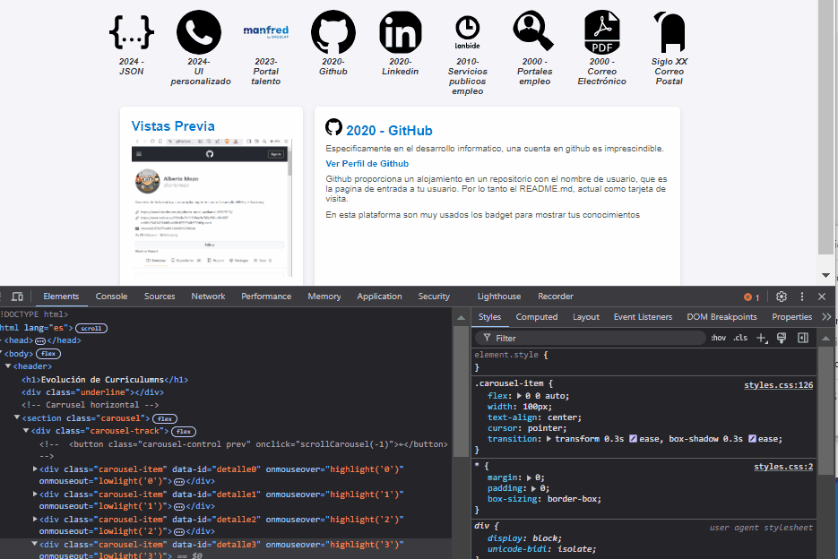

# 📜 Web Curriculum - Evolución Profesional 



> Una página web para mostrar la evolución de mis currículums a través de los años, con un diseño interactivo y visualmente atractivo.

## 🛠 Tecnologías

Este proyecto está construido utilizando:

- **HTML** - Estructura de la página
- **CSS** - Diseño y estilos, con efectos visuales en el carrusel y la barra lateral
- **JavaScript (Vanilla)** - Dinamismo y lógica para la interacción entre el carrusel, la barra lateral y el contenido central

## 🚀 Funcionalidades

✨ **Carrusel Interactivo**: Un carrusel horizontal que muestra versiones anteriores de mi currículum. Al pasar el ratón, se resaltan detalles de cada versión.  
📜 **Barra Lateral de Navegación**: Una barra lateral con una breve descripción de cada currículum. Al hacer clic o pasar el ratón sobre cada entrada, se sincroniza con el carrusel y muestra información detallada a la derecha.  
🔍 **Contenido Detallado**: Al seleccionar un currículum, el área de contenido muestra los detalles específicos de la versión elegida.

## 📂 Estructura del Proyecto

```plaintext
.
├── index.html         # Página principal con la estructura HTML
├── styles.css         # Estilos CSS
├── script.js          # Funciones en JavaScript para la interactividad
└── _docs/
    └── webcurriculum.gif  # Gif animado de demostración
